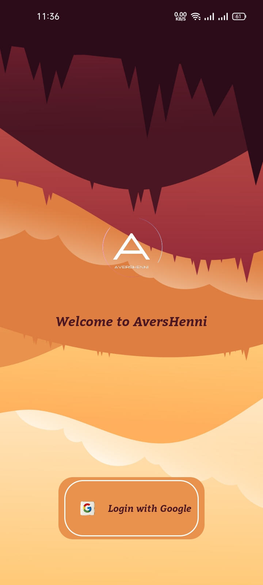

 
<h2 align="center"><b>AversHenni</b></h2>
<h4 align="center">An Android app to watch anime, manga, and hentai on your phone without ads.</h4>

 

<b>WARNING: This is a beta version of the application; therefore, you may encounter bugs.</b>

<h3 align="center">**Star :star:  this repo to show your support and it really does matter!** :clap:</h4>

 

## Screenshots

## Description

AversHenni parses website data and removes the ads for a seamless experience. 

### Features

* Recently Added Episodes
* Popular Animes, Mangas, Hentai
* Anime Movies
* Watch Progress
* Add To Favourites
* Auto Quality for Video Playback
* Ads Free Video Playback
* Directly skip to next/previous episode from player.

### Coming Features

* New anime, manga, and hentai websites will be added.
* And many more
